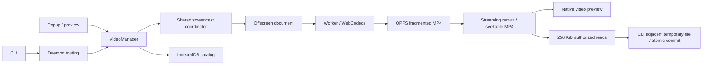

# Task video recording

Video recording captures one authorized task tab as a silent H.264 MP4. It is
independent of semantic action recording. This version keeps the tab fixed;
following task tab switches is deliberately deferred.

## User flow

The primary entry is a request to the agent: “Perform this task and record the
process; let me preview the video afterwards.” The agent creates a session or
borrows the authorized tab, starts recording and waits for its first encoded
frame **before** navigation/task operations. After the final operation, it waits
for navigation and the expected page result to settle, confirms that result, then
stops recording before ending the session. Stopping while navigation is unresolved
produces partial video even when the task action has succeeded. A failed start is
reported before continuing without video. Recording is opt-in; choosing a save
location does not block start.

Both CLI and DSH agents can manage this sequence. The extension's Features → Video
recording offers a harness-neutral prompt even with no running task. Its duration
and quality settings are included in the copied instructions. Manual recording is
in a secondary section: choose a running task and an authorized tab (a sole choice
is selected automatically), then start. The extension badge shows REC. Closing the
popup is safe. While active, the panel prioritizes elapsed/remaining time, Stop
recording, and Stop task actions. Stopping a video leaves its task running.

The recent recordings page offers native video playback, seeking, Save MP4 as,
and deletion. “Recording complete · waiting to save” remains until Chrome reports
a successful download. Canceled or failed downloads do not count as saved.
Partial recordings remain clearly labeled with their interruption reason.

The CLI controls are:

```sh
bsk video start --session <task> --tab-id <tab> --duration 60s --quality standard
bsk video status --recording <recording_id>
bsk video stop --recording <recording_id>
bsk video save --recording <recording_id> --out ./result.mp4
bsk video list --browser <browser>
bsk video discard --recording <recording_id>
```

There is no default output directory. `stop --out` also exports; existing files
require `--overwrite`. CLI exports write on the CLI machine, while Save As writes
on the browser machine. Start supports a stable `--request-id` for lost-response
retries and `--max-duration` as an alias for `--duration`. Stop is idempotent after
automatic stop. Omitting an artifact selector requires exactly one match. `list`
discovers artifacts started from either UI.

Defaults: 60 seconds, standard quality (longest edge ≤1280, target 15 fps,
2 Mbps). Clear quality uses ≤1920, target 30 fps, 4 Mbps. Limits: 1 second to
10 minutes, 256 MiB per video, 1 GiB temporary budget, 24-hour retention. Frame
rate and bitrate are targets; static pages use sparse samples with real durations.
H.264 availability depends on the browser and OS; unsupported configurations fail
before a successful start response. Microphone/system audio is never requested.

## Architecture



`VideoManager` owns target authorization, one-browser concurrency, lifecycle,
overlay coordination and connection ownership. The offscreen host manages one
worker independently of popup lifetime. A long-lived runtime Port carries control
requests and frames; document discovery runs only when connecting, not per frame. The worker owns the encoder and OPFS
files. Mediabunny muxes and remuxes packets; there is no runtime ffmpeg dependency
and no second encode when producing the final seekable MP4.

State transitions are `starting → recording → finalizing → ready|failed`.
Starting returns only after encoding the first valid frame. Capture stops on the
selected deadline or size cap, and on tab/session/connection termination.
Intentional user/cap stops are complete; interruptions are partial if playable.
The catalog preserves the reason and any failure, independently of live sessions.

The CDP screencast coordinator owns one stream and ACK per tab/attachment. Video
and Windows long-screenshot keepalive share leases. Releasing an old lease cannot
stop a replacement attachment or another consumer. Capture retains only an
in-flight frame and the newest pending frame. Canvas dimensions stay fixed and
resizes are letterboxed. A monotonic timeline preserves elapsed static time and
caps the final duration without compressing periods with dropped frames.
Capture reads have a 10-second deadline. Stopping during startup cancels the wait
for a stalled renderer; a late screenshot cannot open an encoder after cleanup.

Video's idempotent overlay lease is separate from short screenshot suppression.
Content initializes the lease asynchronously after mounting and registering its
listeners, so ordinary page setup does not wait for a video request. Until that
state is known, control and interactive overlays stay hidden. This also covers a
navigation completing before the new document's message listener is registered.
Discovery makes at most three attempts, with a three-second deadline per reply.
After those attempts fail, a foreground transition or a new control, borrow,
help, or action-recording request can restart discovery. Healthy pages do not
poll. Prerendered documents wait for activation, and restored documents refresh
their state. The bridge resolves the sender by document ID and requires an active
outermost frame, rather than assuming every top-level sender has frame ID zero.
Background pushes cancel pending retries; late replies and disposed documents
cannot change the gate. A failed query never grants permission to expose controls
in an active recording.
The start handshake hides controls before the first screenshot. Interactive
confirmation/help overlays wait until frame intake closes and the worker switches
to a localized user-confirmation slate. Clean rendering is acknowledged before
capture resumes; stale document messages and
pre-resume frames are rejected. Navigation holds the last clean frame without a
slate. Both completed and failed navigation events recheck the current overlay and
restore capture, including error pages, downloads, HTTP 204 and canceled requests.
Network error pages and PDF viewers may end with a partial artifact if capture
cannot resume. The navigation fallback allows 60 seconds for slow pages to settle,
then stops as partial. This bounds time spent recording a frozen frame without
prematurely ending slower page loads. The chosen duration limit still applies
during the wait. Stopping or reaching that limit before a clean
frame returns also cannot mark it complete. Popup task interruption remains accessible.

## Storage, access and failure handling

Fragments are flushed during recording. Normal stop remuxes complete packets into
a seekable MP4 without reencoding. The final copy flushes once before committing
metadata; the durable fragment journal remains until that commit succeeds. Recovery discards incomplete tail boxes and
uses complete fragments. An interrupted final fragment can be lost; this is
reported as a partial recording, never as a complete result. No complete fragment
means failed with an actionable error. Worker failure resets the encoder worker
so a bounded recovery attempt can salvage committed fragments.

The catalog and OPFS artifacts survive task deletion and connection teardown.
Reserve space for both the recording and its final remux before starting. Count
failed journals and unfinished remux files against the budget. Expired artifacts
are removed on startup/catalog access; unexpired evidence is never silently
evicted to make room.

Artifact IDs are not authority. Remote reads also require the original connection
owner and a random capability. Only extension-owned popup/preview pages can use
the local UI bridge. Content messages are restricted to the sender's current
top-level document. Public metadata strips capabilities. The CLI stores private
grants in the existing per-user application directory, and the browser catalog
remains authoritative after reconnects. Video commands remove expired CLI grant
files using their recorded expiration time; unrelated files are left intact.
Protocol error codes and diagnostic data survive validation, capture and worker IPC.

`tool.video` exposes a versioned capability probe. Start uses the existing task
queue and user-interrupt gate; artifact/status/stop operations route directly to
the selected browser, so they remain usable during long actions and after task
deletion. Chunk identity, offset, decoded length and total size are validated.
The final user path never crosses the browser transport. A failed transfer cannot
replace an existing destination or expose a partially written final file.

## Validation

Unit coverage includes timeline bounds, fragment salvage, bounded frame intake,
ownership/capabilities, idempotent stops, overlay gating, slow-navigation recovery,
and screencast sharing. A browser regression delays both content startup and video
state discovery, injects a failed query, then checks decoded pixels in the control
pill and border regions. Recovery tests mount the real control, borrow, help, and
action-recording overlays after transient and exhausted queries. Browser coverage
also checks borrow/help recovery without a video-state push and real Speculation
Rules prerender activation with a nonzero outermost frame ID.
Existing full-page screenshot lifetime tests cover cancellation and attachment
replacement. The opt-in browser regressions use temporary Chrome profiles and an
isolated daemon, with the production extension/encoder and real MP4 decoding:
use Chrome for Testing to allow loading the isolated unpacked extension.

```sh
cargo build -p bsk --locked
pnpm --filter @browser-skill/extension build
pnpm --filter @wxg-prc-cpg/browser-skill-dsh-plugin build
cd apps/extension
BSK_VIDEO_CHROME=/path/to/chrome BSK_VIDEO_BSK=../../target/debug/bsk \
  pnpm exec vitest run src/video/*.browser.test.ts
```

The extension's minimum Chrome version remains 125. Codec support is validated at
runtime. DSH uses `browser_inspect(action=video)` with `videoAction` set to start, status,
stop, save, list, or discard. Its six public tool schemas are retained. Start
follows the session queue; artifact operations bypass that queue so status/stop
remain available during human help. A plugin-local allowlist of returned recording
IDs outlives session teardown; retry keys are scoped to the plugin and session
lifetime. A shared CLI cache or an arbitrary ID does not grant
access to other tasks' videos. List is filtered to these IDs. Plugin reloads clear
this allowlist; the extension library remains available for recovery. CLI partial
stop/save errors retain their recording metadata and saved path in the tool error.

```text
browser_inspect({ action: "video", videoAction: "start", session: "<task>", durationMs: 60000 })
// Execute task operations after state=recording.
browser_inspect({ action: "video", videoAction: "stop", recordingId: "<recording_id>" })
// End the task. Preview and Save As remain available in the extension.
browser_inspect({ action: "video", videoAction: "save", recordingId: "<recording_id>", output: "<explicit-path.mp4>" })
```


## Capacity benchmark

The manual benchmark uses the production WebCodecs/OPFS pipeline in an isolated
Chrome worker. `BSK_VIDEO_STRESS=size` feeds high-entropy 1920×1080 images at the
clear preset until the size cap. `BSK_VIDEO_STRESS=duration` runs a moving pattern
for the full ten-minute limit. Each run also remuxes 18,000 real AVC keyframes
with valid filler NALs into a near-256 MiB, ten-minute MP4, stressing both the
maximum packet table and file size without waiting for another recording.
The benchmark asserts finalization stays below the offscreen worker's 29-second
watchdog. It measures encoder flush, journal finalization and remux for real
capture, and remux separately for the capacity fixture.

```sh
cd apps/extension
BSK_VIDEO_CHROME=/path/to/chrome BSK_VIDEO_STRESS=size \
  BSK_VIDEO_BENCHMARK_OUT=/tmp/video-capacity.json \
  pnpm exec vitest run src/video/stress.browser.test.ts
# Repeat with BSK_VIDEO_STRESS=duration for the full ten-minute capture.
```

On macOS arm64 / Chrome for Testing 149.0.7827.55:

| Workload | Finalization |
| --- | --- |
| Full 600-second clear capture, 1920×1080, 136,474,558 bytes | 388 ms |
| High-entropy clear capture reaching the size cap, up to 267,628,206 bytes | 177–261 ms |
| 18,000 frames / 600 seconds, 266,956,902-byte capacity fixture | 409–492 ms |

The capacity fixture also decodes and seeks to 599.9 seconds in Chrome's native
video element. Bitrate is an encoder target, so high-entropy input reached the
byte cap before the duration limit. These are local measurements, not a timing
guarantee for slower disks or other operating systems.
